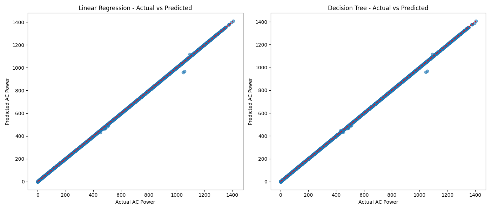

این پروژه با هدف پیش‌بینی متغیر AC_POWER بر اساس ویژگی‌های DC_POWER، DAILY_YIELD و TOTAL_YIELD پیاده‌سازی شده است. داده‌ها از یک دیتابیس جدید بارگذاری شده و دو مدل ساده Linear Regression و Decision Tree برای پیش‌بینی استفاده شدند. نتایج نشان می‌دهد که مدل Decision Tree در این پروژه عملکرد بهتری داشته و خطای کمتری دارد.
